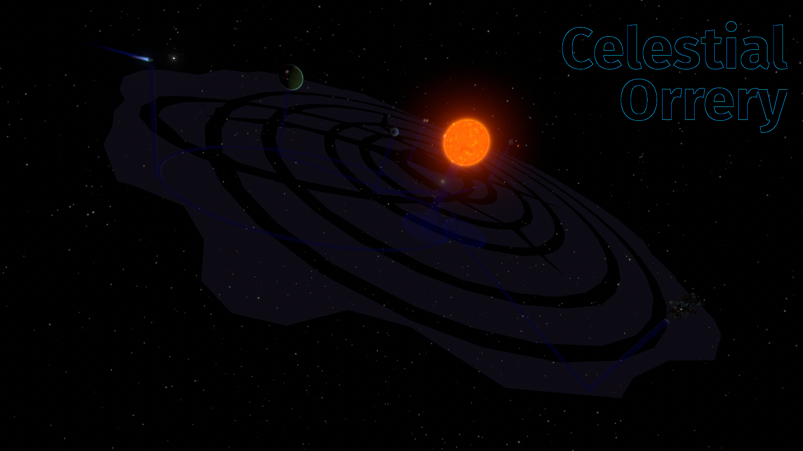

# Celestial Orrery (a mod for Outer Wilds)

Created as part of the [2023 New Horizons Jam](https://outerwildsmods.com/jam/), 
this mod for Outer Wilds projects onto the actual environment of the game a
version of the orrery (the model of the star system) seen in the observatory. 
This makes it easier for the players to navigate through the system 
(because there is a "ground" they can use to orientate themselves and to 
estimate distances to the different planets), while also increasing the "toybox"
aspect of the game space.

This mod follows the "Clockwork" and "Layers" themes of the jam, by recreating a 
complex mechanical mechanism composed of multiple layers (including the animated
gearbox at the bottom). However, this approach also introduces a popular 
psychological question that explores the theme of "Layers" even further: 
"When our environment and our model of it become so similar... how can we know 
whether we ourselves are part of a model or not?" (a variant of the 
[Simulation hypothesis](https://en.wikipedia.org/wiki/Simulation_hypothesis)).